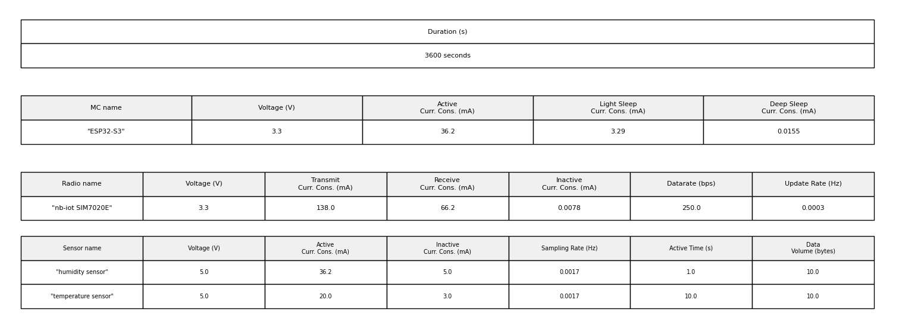
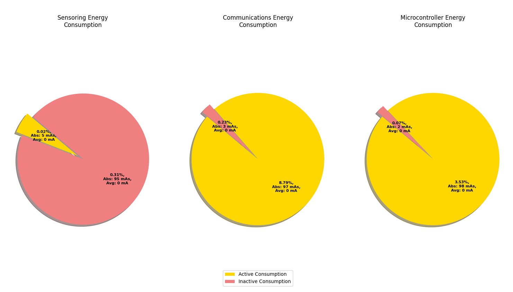
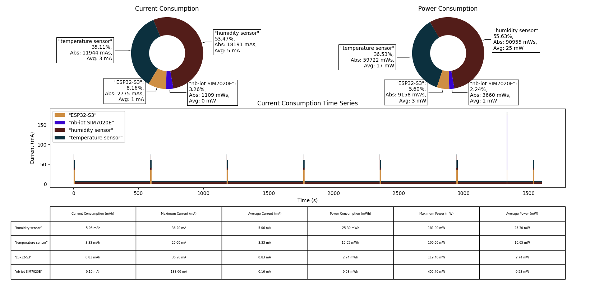

# Energy Consumption Estimator

This Python program helps you estimate the energy consumption of an embedded system composed of **sensors**, a **microcontroller**, and a **radio interface** over a given measurement duration. The tool guides you through inputting component specifications and then computes and visualizes different cosumption aspects of the system.

---

## 🛠️ Features

- Interactive CLI input to define system components:
  - Sensors (with configurable sampling rates and activity profiles)
  - Microcontrollers (including different power states)
  - Radio Interfaces (data rates, active/inactive states)
- Supports loading from a predefined list of available components
- Calculates total energy consumption over a user-defined time span
- Displays energy usage with:
  - System settings table
  - Results table
  - Pie charts with consumption from different components
  - Pie charts with active/inactive consumption for all the components
  - Timeserie plot with consumption of the system over the measurement time. Splitting the cunsumption by components

---

## 🖥️ How to Use

### 1. Start the Program

Run the program in your terminal:

```bash
python3 consumption_calculator.py
```

### 2. Input System Components

You will be prompted to enter details for each component of your system.

#### Example Prompt Flow

```text
Do you want to enter a Sensor, Microcontroller, or RadioInterface? (Enter 'exit' to quit): sensor
Enter sensor name: Solar Irradiance Sensor
Enter operating voltage (V): 5
Enter active consumption (mA): 50
Enter inactive consumption (mA): 5
Enter sampling rate (Hz): 0.001
Enter active time (seconds): 3
Enter data volume (bytes/sampling): 2
```

You can add multiple components or select from pre-loaded ones:

```text
Do you want to enter a Sensor, Microcontroller, or RadioInterface? (Enter 'exit' to quit): exit

0: Sensor(name="humidity sensor", ...)
1: Sensor(name="temperature sensor", ...)
2: Sensor(name="Solar Irradiance Sensor", ...)
Enter the positions of the sensors to load (comma-separated): 0,1,2

0: Microcontroller(name="ESP32-S3", ...)
Enter the position of the microcontroller to load: 0

0: RadioInterface(name="nb-iot SIM7020E", ...)
Enter the position of the radio interface to load: 0
```

### 3. Set the Measurement Duration

You’ll be prompted to enter the total time over which energy should be calculated:

```text
Enter the duration of the measurement (seconds): 3600
```

### 4. Review Output
Use the generated visualizations to understand your project consumption profile.

---

## 📊 Output Visualizations

The program will generate three figures with different visualizations.
1. First figure contains a table for each selected component with its specifications.

2. It contains three pie charts, one for each system componment (sensoring, microcontroller and radio interface). The chart compares the active/inactive consumption of the components. All sensors are summarized in just one chart.

3. Last figure displays the consumption of the whole system split by components. In the upper side there are two pie charts with the current and power consumption respectively. In the middle there is a time series plot with all components consumption stacked over the time. And in the lower side there is a table displaying the following values for each component:
    
    - Current consumption
    - Maximum current
    - Average current
    - Power consumption
    - Maximum power
    - Average power



---

## 📦 Requirements
Make sure you have the following Python packages installed:

- `matplotlib` – For generating plots and tables.
- `numpy` – For numerical operations.
- `pandas` – For tabular data handling.
- `IPython` – For enhanced output display (used primarily in Jupyter environments).
- `math` and `random` – Built-in Python libraries (no installation needed).

You can install the required packages using pip:

```bash
pip install matplotlib numpy pandas ipython
```
---

